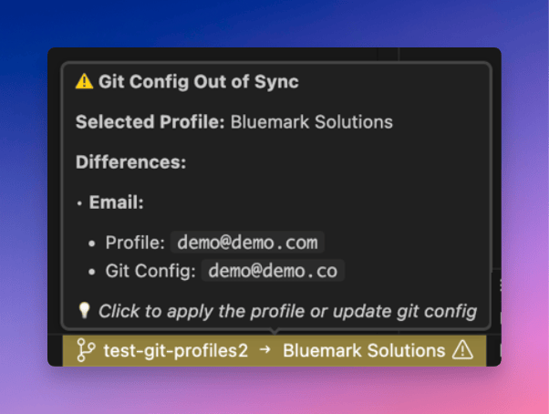
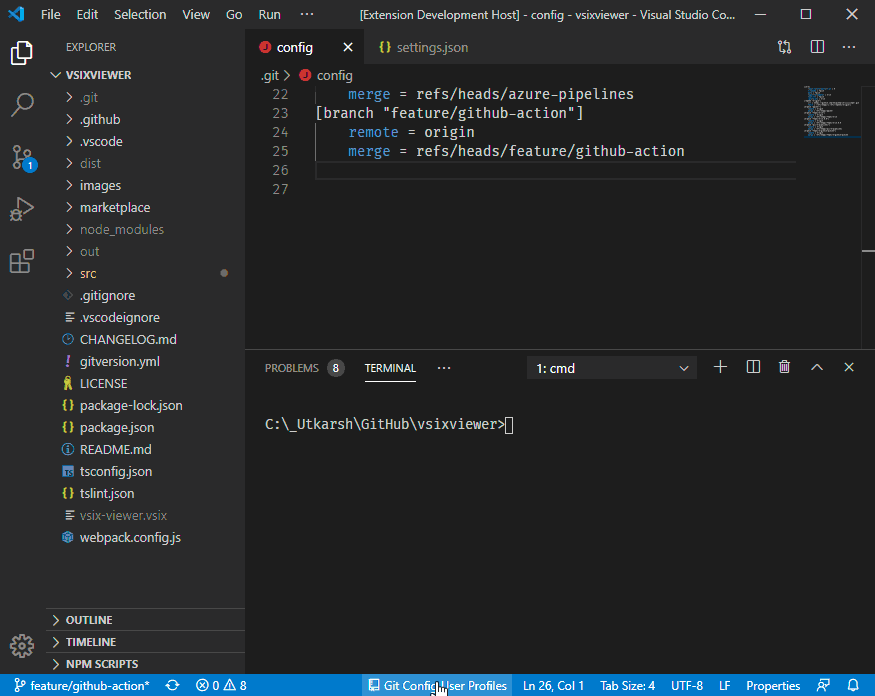
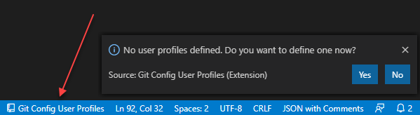
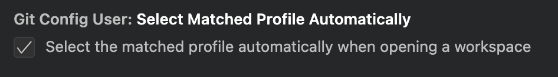
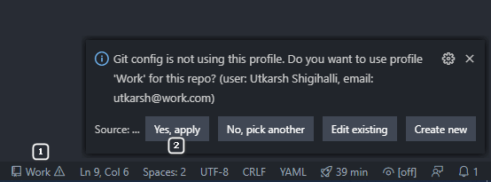
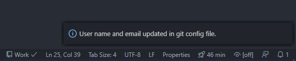

# Git Config User Profiles

Ever wanted to use different username and email addresses for your commits at work and for your personal repositories? While it is easy to do using `git config` command, this extension allows you to maintain different username and email in named profiles and allows you to easily switch and apply to the repository you are working.

## Key Features

- ✅ **Easy Profile Management** - Create, edit, validate, and switch between multiple git user profiles from the status bar
- ✅ **Private Profile Selections** - Profile selections are stored in user settings (local to your machine), not shared with your team
- ✅ **Auto Profile Matching** - Automatically selects the right profile based on your repository's existing git config
- ✅ **Multi-Folder Workspace Support** - Detects which git repository you're working in based on the active file, perfect for monorepos
- ✅ **Visual Sync Indicators** - Status bar shows when your git config is out of sync with the selected profile
- ✅ **Customizable Status Bar** - Choose `full` or `compact` display formats and `left` or `right` alignment to suit your workflow
- ✅ **Detailed Comparison Tooltips** - Hover over the status bar to see:
  - When in sync: Confirmation message with quick action hints
  - When out of sync: Side-by-side comparison showing exactly what differs (username, email, signing key)
  
- ✅ **Profile Validation** - Validate profiles before applying them to ensure email format and git compatibility
- ✅ **Robust Error Handling** - Gracefully handles profiles with missing or invalid fields
- ✅ **Command Palette Access** - All commands available via Command Palette when status bar is crowded



## Usage

### Creating the profiles

Once you install extension, click on 'Git Config Profiles' on the VSCode Status Bar and define few profiles.



> Profiles are stored in your global user settings so they are available across all workspaces, but remain private to you.

### Selecting the profile

Click on the status bar and if you have profiles you will presented with a dialog as below.


Click `Pick a profile` and then select a profile you need.


### Setting the profile selected to the repo

#### Auto selection of profile

When the extension loads up, it looks up the local git config and tries to match it with the profiles defined. If it finds a match, it selects the profile automatically (new behaviour). This behavior can be disabled in settings.



#### Manual selection of profile

If auto selection of profile is disabled, the status bar will show a warning if the repository's username and email do not match any of the profiles, and you can select a profile manually (old behaviour).

Once you select a profile, the status bar text changes to selected profile name [1 in image below]. 

> The icon might display a "warning" sign if the current repo is not using the username and email selected.

If you want to apply the username and email defined in the selected profile to the current repository, click on profile name in the status bar (e.g `Work` ) and then select `Yes, apply` in the dialog [2 image below].



Once the repository's username and email are in sync, you will see warning color go away confirming that repository config is in sync with the profile selected.



### Deleting a profile
Open the Command Palette and type `git config user profiles` or `gcup` and select `Delete a profile`. You will be presented with a list of profiles to delete.

### Validating a profile
Want to test if a profile is properly configured before applying it? Use the **Validate Profile** command:

1. Open Command Palette (`Cmd+Shift+P` / `Ctrl+Shift+P`)
2. Type "Git Config User Profiles: Validate Profile"
3. Select the profile you want to validate

The validation checks:
- ✅ Username is not empty
- ✅ Email is not empty and properly formatted (supports `+` addressing, subdomains, etc.)
- ✅ Git accepts all values (tests actual git config commands)

**Results:**
- **Success**: "✅ Profile 'Work' is valid and ready to use!"
- **Failure**: Detailed list of issues found (e.g., "Email is empty", "Invalid email format")

This is especially useful after creating or editing a profile to ensure everything works correctly.

## Configuration

The extension provides configuration options to customize your experience:

### Status Bar Display Format

Choose how the status bar displays profile information:

- **Full (default)**:
  - Shows repository name and profile with icons
  - Best for larger screens

- **Compact**:
  - Shows only profile with git icon
  - Saves space on smaller screens
  - Repository name shown in tooltip when hovering

To change the format:
1. Open Settings (`Cmd+,` / `Ctrl+,`)
2. Search for "Git Config User Profiles Status Bar Format"
3. Select your preferred format

Or add to your `settings.json`:
```json
{
  "gitConfigUser.statusBarFormat": "compact"
}
```

### Status Bar Alignment

Choose where the status bar item appears:

- **Right (default)**: Position at the absolute right of the status bar
- **Left**: Position at the absolute left of the status bar

To change the alignment:
1. Open Settings (`Cmd+,` / `Ctrl+,`)
2. Search for "Git Config User Profiles Status Bar Alignment"
3. Select your preferred alignment

Or add to your `settings.json`:
```json
{
  "gitConfigUser.statusBarAlignment": "left"
}
```

The change takes effect immediately without needing to reload the window.

### Auto Profile Selection

Enable or disable automatic profile selection based on git config:

```json
{
  "gitConfigUser.selectMatchedProfileAutomatically": true
}
```

When enabled, the extension automatically selects a profile if your current git config matches one of your saved profiles.

## Supported Scenarios

The extension intelligently handles various workspace configurations and provides appropriate feedback through the status bar and tooltips.

### Workspace Configurations

| Scenario                                             | Status Bar Display                                                            | Tooltip                                                                                                                                                       |
| ---------------------------------------------------- | ----------------------------------------------------------------------------- | ------------------------------------------------------------------------------------------------------------------------------------------------------------- |
| **No editors open**                                  | Shows repo name → "No Profile" with question mark icon and warning background | 📂 **No File Open** - No file is currently open in the editor                                                                                                  |
| **Non-file schemes** (Output window, Settings, etc.) | Hidden                                                                        | Status bar is hidden as these are not associated with git repositories                                                                                        |
| **Jupyter Notebooks** (.ipynb)                       | Same as regular files - shows git profile information                         | Same as regular files - displays profile sync status                                                                                                          |
| **File in non-git folder**                           | Hidden                                                                        | ⚠️ Status bar is hidden when not in a git repository. Use "Show Extension Status" command to see why                                                           |
| **No profiles created**                              | Shows repo name → "No Profile" with question mark icon and warning background | 📋 **No Profiles Created** - No profiles have been created yet                                                                                                 |
| **Git repo, no profile selected**                    | Shows repo name → "No Profile" with question mark icon and warning background | ⚠️ **No Profile Selected** - No profile has been selected for this repository                                                                                  |
| **Git repo, profile selected, in sync**              | Shows repo name → profile name with normal background (no icons)              | ✅ **Profile Active: Profile Name** - Your git config is in sync with this profile. *Click to switch profiles*                                                 |
| **Git repo, profile selected, out of sync**          | Shows repo name → profile name with alert icon and warning background         | ⚠️ **Git Config Out of Sync** - Shows side-by-side comparison of differences (username, email, signing key). *Click to apply the profile or update git config* |
| **Profile configuration error**                      | Shows repo name → profile name with error icon and error background           | ❌ **Profile Configuration Error** - Selected profile is missing required information                                                                          |
| **Nested git repositories**                          | Works correctly by detecting git root from file location                      | Each nested git repo can have its own profile selection                                                                                                       |
| **Extension status hidden**                          | Use "Show Extension Status" command                                           | ⚠️ Status bar is hidden when not in a git repository. Use "Show Extension Status" command to see why                                                           |

### Checking Extension Status

If you're wondering why the status bar is not visible, or want to see detailed information about the extension's current state, use the **"Git Config User Profiles: Show Status"** command from the Command Palette.

To access it:
1. Open the Command Palette (`Cmd+Shift+P` on macOS or `Ctrl+Shift+P` on Windows/Linux)
2. Type "Git Config User Profiles: Show Extension Status"
3. Press Enter

### Multi-root and Nested Repository Support

The extension fully supports complex workspace configurations:

- **Parent folder with multiple git repos**: Open a parent folder containing multiple nested git repositories, and the extension will detect the correct git repo based on which file you have open.
- **Multi-root workspaces**: Each workspace folder can have its own profile selection.
- **Mono repositories**: Works correctly in mono repos by traversing up to find the git root from the opened file's location.

> All tooltips are kept minimal for quick readability. Click the status bar icon for detailed information and available actions.

<br/>

## Technical Details: How Profile Storage Works

> **Note:** This section is for advanced users who want to understand the internals. Most users don't need to read this!

### Profile Definitions Storage

- **Where:** User Settings (Global)
- **Setting:** `gitConfigUser.profiles`
- **Shared with team:** ❌ No

Your profiles (name, email, signing key) are stored in your global user settings, available across all workspaces but private to you.

### Profile Selection Storage

- **Where:** User Settings (Global, keyed by workspace path)
- **Setting:** `gitConfigUser.workspaceProfileSelections`
- **Shared with team:** ❌ No

Your selections are stored in a map like this:
```json
{
  "gitConfigUser.workspaceProfileSelections": {
    "/path/to/work-project": "work-profile-id",
    "/path/to/personal-project": "personal-profile-id"
  }
}
```

This allows workspace-specific selections while keeping them private to each developer.

### Profile Selection Priority

When opening a workspace, the extension determines the profile in this order:

1. **User settings map** (`workspaceProfileSelections`) - Current storage location (v2.2.0+)
2. **Auto-matching** - If auto-select is enabled and no profile is selected, matches git config against profiles
3. **Legacy `.vscode/settings.json` file** - Automatically migrated to user settings if found
4. **Legacy workspace settings** - Automatically migrated from old workspace-scoped settings
5. **Legacy global selected flag** - Backwards compatibility with v1.x (deprecated)

### Migration from v2.1.0 and Earlier

The extension automatically migrates old profile selections:
- ✅ Reads old selections from `.vscode/settings.json` or workspace settings
- ✅ Migrates to new user settings storage (`workspaceProfileSelections`)
- ✅ Cleans up old settings from `.vscode/settings.json` and workspace settings
- ✅ Works seamlessly - no user action needed!
- ✅ One-time migration happens transparently when you open a workspace

### FAQ

**Q: Why not store selections in `.vscode/settings.json`?** 

A: That file is often committed to git and shared with the team. Profile selections are personal (your email vs teammate's email).


**Q: Can team members use different profiles for the same project?**

A: Yes! Each person has their own private selections.

**Q: Will selections sync across machines?**

A: Profile definitions sync via VSCode Settings Sync. Selections are stored in user settings and will sync if you have Settings Sync enabled, allowing your profile selections to follow you across machines.

### Star History

[](https://www.star-history.com/#onlyutkarsh/git-config-user-profiles&type=date&legend=top-left)

### Issues and feature requests

If you find any bug or have any suggestion/feature request, please submit the [issue](https://github.com/onlyutkarsh/git-config-user-profiles/issues) in the GitHub repo.

