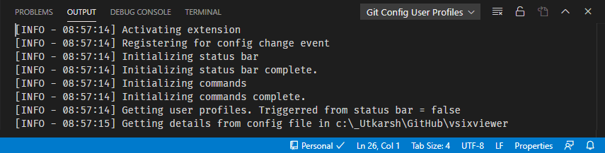

# Git Config User Profiles

Ever wanted to use different username and email addresses for your commits at work and for your personal repositories? While it is easy to do using `git config` command, this extension allows you to maintain different username and email in named profiles and allows you to easily switch and apply to the repository you are working.

## Usage

### Creating the profiles
---
Once you install extension, click on 'Git Config Profiles' on the VSCode Status Bar and define few profiles. 

> Profiles defined are stored in global settings file in VSCode so that they are available for all other repositories.

 

### Selecting the profile
---

Click on the status bar and if you have profiles you will presented with a dialog as below.

Click `Pick a profile` and then select a profile you need.

 

### Setting the profile selected to the repo
---
Once you select a profile, the status bar text changes to selected profile name [1 in image below]. 

> The icon might display a "warning" sign if the current repo is not using the username and email selected.

If you want to apply the username and email defined in the selected profile to the current repository, click on profile name in the status bar (e.g `Work` ) and then select `Yes, apply` in the dialog [2 image below].

Once the repository's username and email are in sync, you might see a check icon confirming that repository config is in sync with the profile selected.

### Issues and feature requests

If you find any bug or have any suggestion/feature request, please submit the [issue](https://github.com/onlyutkarsh/git-config-user-profiles/issues) in the GitHub repo. It is helpful to troubleshoot if you paste results of `Output` window when submitting issues. 

