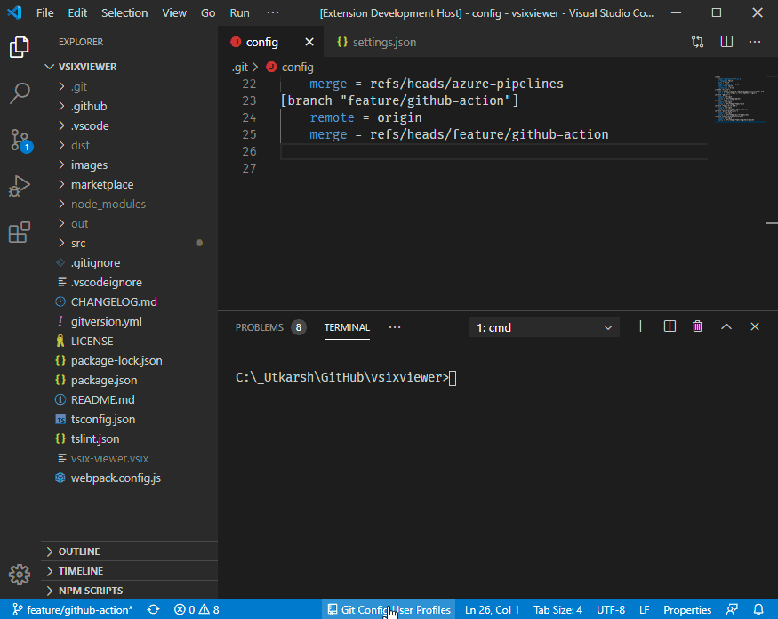
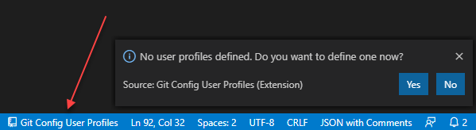
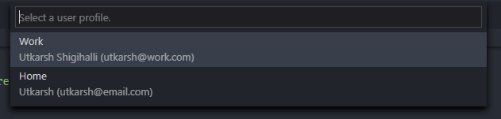
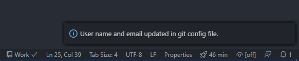

# Git Config User Profiles

Ever wanted to use different username and email for commits at work vs. personal repositories? This extension lets you define named profiles (username, email, signing key) and switch or apply them per repository, right from the status bar.



## Features

- **Easy profile management** - create, edit, delete, and validate profiles from the status bar or Command Palette
- **Private per-repo selections** - stored in your user settings, never in `.vscode/settings.json`, so selections aren't shared with your team
- **Auto profile matching** - automatically selects the profile matching the repo's existing git config (can be disabled)
- **Multi-folder & monorepo support** - detects the right git repository based on the active file
- **Visual sync indicators** - status bar warns when the repo's git config differs from the selected profile; hover for a side-by-side diff (username, email, signing key)
- **Per-repository commit signing** - profiles can set `signingKey`, `commit.gpgSign`, and `gpg.format`
- **Customizable status bar** - `full`/`compact` format, `left`/`right` alignment, show always or only in git repos
- **Optional form-based UI** - enable with `"gitConfigUser.useUIToEdit": true` to create/edit/delete profiles via a panel instead of step-by-step dialogs

## Quick Start

1. **Create a profile** - click `Git Config Profiles` in the status bar (or run `Git Config User Profiles: Create a profile` from the Command Palette). Profiles are stored in global user settings, available across all workspaces but private to you.

   

2. **Pick a profile** - click the status bar item and choose `Pick a profile`.

   

3. **Apply it** - if the repo is out of sync (warning icon), click the profile name in the status bar and choose `Yes, apply` to write the profile's username/email/signing settings to the repo's local git config. The warning disappears once in sync.

   

> **Tip:** When the extension loads, it matches the repo's git config against your profiles and selects the matching one automatically. Disable this via `gitConfigUser.selectMatchedProfileAutomatically`.

## Commands

All commands are available from the Command Palette - type `git config user profiles` or `gcup`.

| Command                              | What it does                                                         |
| ------------------------------------ | -------------------------------------------------------------------- |
| **Create / Edit / Delete a profile** | Manage your profiles (step-by-step dialog or form UI)                |
| **Pick a profile**                   | Select and optionally apply a profile to the current repo            |
| **Cycle to Next Profile**            | Apply the next profile in your list - great when bound to a shortcut |
| **Validate Profile**                 | Check username/email format and that git accepts the values          |
| **Show Extension Status**            | Explains why the status bar is hidden or showing a warning           |

Example keybinding for cycling profiles (`keybindings.json`):

```json
{
  "key": "cmd+alt+g",
  "command": "git-config-user-profiles.cycleUserProfile"
}
```

## Settings

| Setting                                           | Default  | Description                                                   |
| ------------------------------------------------- | -------- | ------------------------------------------------------------- |
| `gitConfigUser.statusBarFormat`                   | `full`   | `full` shows repo + profile; `compact` shows only the profile |
| `gitConfigUser.statusBarAlignment`                | `right`  | `left` or `right` position in the status bar                  |
| `gitConfigUser.statusBarVisibility`               | `always` | `always` or `git-repos-only`                                  |
| `gitConfigUser.selectMatchedProfileAutomatically` | `true`   | Auto-select the profile matching the repo's git config        |
| `gitConfigUser.useUIToEdit`                       | `false`  | Use the form-based UI for create/edit/delete                  |

## Commit Signing Behavior

A profile's signing fields (`signingKey`, `commitGpgSign`, `gpgFormat`) are written to the repository's **local** git config when the profile is applied. Fields left empty on the profile remove the local override, so the repo falls back to your global Git settings.

Sync checking is strict: a repo is only "in sync" when its local values match the profile (or the global value for fields the profile leaves empty). If a repo needs a different signing key than your global config, set that key on the profile itself or re-apply the repo's key after switching.

## Where Is Data Stored?

- **Profiles** → global user settings (`gitConfigUser.profiles`) - private to you, available in all workspaces, and synced via VS Code Settings Sync.
- **Repo ↔ profile selections** → global user settings, keyed by workspace path (`gitConfigUser.workspaceProfileSelections`) - private per developer, so teammates can each pick their own profile for the same project.
- Selections from older versions (`.vscode/settings.json` or workspace settings) are **migrated automatically** on first load - no action needed.

## Issues and Feature Requests

Found a bug or have a suggestion? Please file an [issue](https://github.com/onlyutkarsh/git-config-user-profiles/issues) on GitHub.

